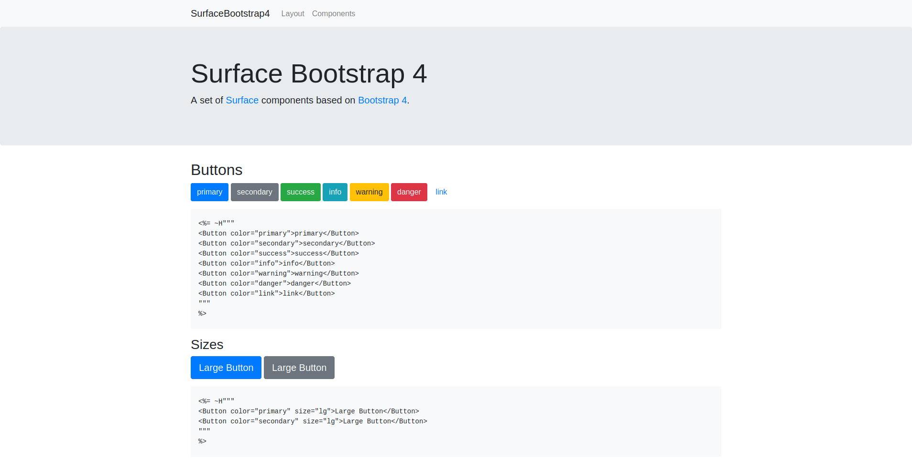

# SurfaceBootstrap4Demo

A Phoenix application to demonstrate the 
[SurfaceBootstrap4](https://github.com/tschmidleithner/surface_bootstrap4) library using 
[Surface](https://github.com/msaraiva/surface/).

To start your Phoenix server:

  * Install dependencies with `mix deps.get`
  * Start Phoenix endpoint with `mix phx.server`

Now you can visit [`localhost:4000`](http://localhost:4000) from your browser.

## Preview

## License

Copyright (c) 2020, Thomas Schmidleithner.

This code is licensed under the [MIT License](LICENSE.md).